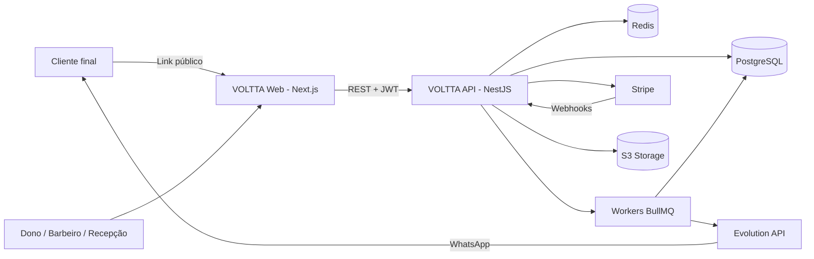
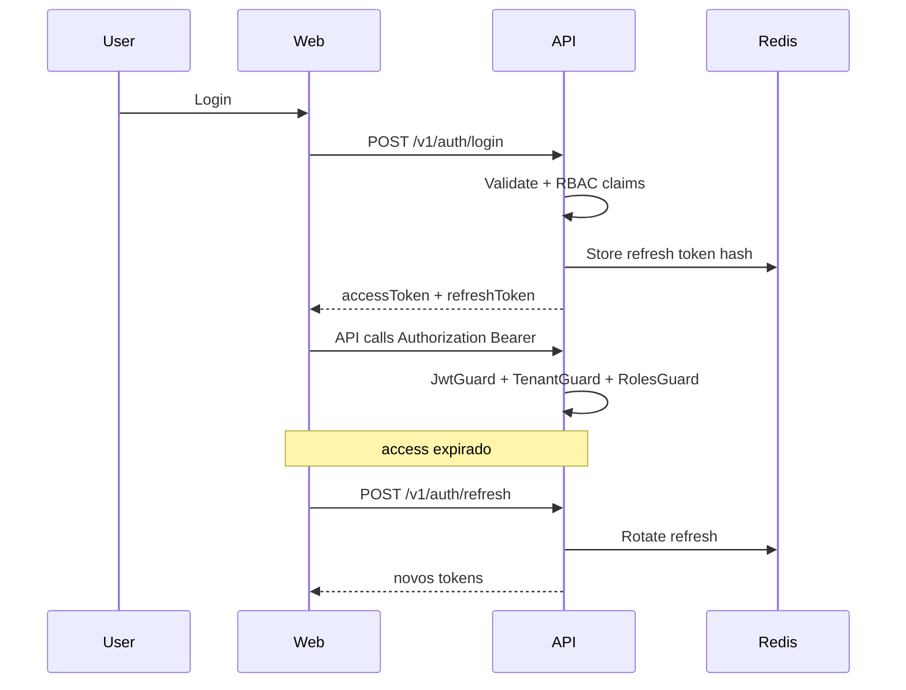
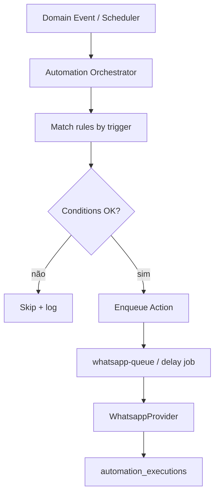
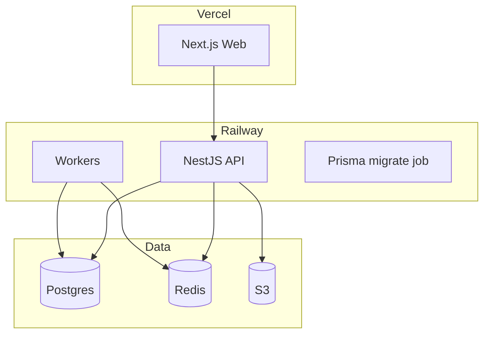

# 03 — Arquitetura de Software · VOLTTA™

**Versão:** 1.0  
**Estilo:** DDD + Clean Architecture + Event-Driven (pragmático para MVP)  
**Relacionado:** [PRD](02-prd.md) · [ERD](04-database-erd.md)

---

## 1. Princípios

1. **Domain first:** regras de retenção e billing no domínio, não em controllers.
2. **Multi-tenant por padrão:** `CompanyId` obrigatório em repositórios de negócio.
3. **Ports & Adapters:** `WhatsappProvider`, `PaymentProvider`, `StorageProvider`.
4. **Async nos edges:** WhatsApp, e-mail, score batch, webhooks pesados → BullMQ.
5. **CQRS leve:** leituras de dashboard/analytics via queries dedicadas; writes via use cases.
6. **Sem over-engineering:** um monorepo lógico com `apps/api`, `apps/web`, `packages/*` se necessário; bounded contexts claros sem microserviços no MVP.

---

## 2. Diagrama de contexto (C4 L1)



---

## 3. Bounded Contexts

| Context | Responsabilidade | Exemplos |
|---------|------------------|----------|
| **Identity & Access** | Auth, users, roles, refresh | Login, RBAC |
| **Tenant** | Company, settings, slug, trial | Onboarding |
| **CRM** | Customers, segments, scores | Score VOLTTA |
| **Catalog** | Services | Intervalo retorno |
| **Scheduling** | Appointments, availability, public booking | Agenda |
| **Automation** | Rules engine, executions | A1–A5 |
| **Messaging** | WhatsApp connection, send | Evolution |
| **Billing** | Subscriptions, payments, Stripe | Checkout |
| **Finance** | Revenues, indicators | Caixa simplificado |
| **Analytics** | Dashboard metrics, projections | CQRS read |
| **Audit** | Audit logs, LGPD events | Compliance |

Comunicação entre contexts: **Domain Events** in-process + outbox/fila quando cruzar processo.

---

## 4. Estrutura de pastas (API NestJS)

```
apps/api/src/
  domain/
    crm/
    scheduling/
    automation/
    billing/
    messaging/
    tenant/
    identity/
    shared/          # Value Objects, CompanyId, Result, DomainEvent
  application/
    crm/
      use-cases/
      ports/
      dto/
    scheduling/
    automation/
    billing/
    ...
  infrastructure/
    persistence/prisma/
    queue/bullmq/
    providers/whatsapp/
    providers/payment/
    providers/storage/
    mail/
    security/
  presentation/
    http/            # controllers, guards, filters, interceptors
    swagger/
  shared/
    config/
    logging/
    utils/
```

**Regra de dependência:** `presentation` → `application` → `domain` ← `infrastructure`.

---

## 5. Estrutura Frontend (Next.js 15)

```
apps/web/
  app/
    (marketing)/     # Landing
    (auth)/          # Login, signup, forgot
    (app)/           # Dashboard autenticado
    agendar/[slug]/ # Público
  components/
  features/          # Por bounded context UI
  lib/               # api client, auth, query
  stores/            # Zustand
  styles/
```

- Server Components onde fizer sentido; mutações via client + TanStack Query.
- Forms: RHF + Zod.
- UI: ShadCN + Tailwind.

---

## 6. Fluxo de autenticação



Claims JWT: `sub`, `companyId`, `role`, `sessionId`.

---

## 7. Multi-tenancy

1. Toda request autenticada resolve `companyId` do token (nunca do body, exceto super-admin futuro).
2. Prisma middleware / repository base injeta `where: { companyId }`.
3. Rotas públicas (`/agendar/:slug`) resolvem company pelo slug e aplicam o mesmo escopo.
4. Testes de regressão: tentativa cross-tenant → 404/403.

---

## 8. Event-Driven (MVP)

### Domain Events (exemplos)

- `AppointmentCreated`
- `AppointmentCompleted`
- `AppointmentCanceled`
- `CustomerBirthdayDetected`
- `SubscriptionActivated`
- `SubscriptionPastDue`
- `SubscriptionSuspended`
- `WhatsappMessageFailed`

### Filas BullMQ

| Fila | Uso |
|------|-----|
| `automation-queue` | Avaliar regras / agendar actions |
| `notification-queue` | E-mail / in-app |
| `whatsapp-queue` | Envio Evolution + retry |
| `billing-queue` | Processar side-effects Stripe |
| `analytics-queue` | Score, segmentos, dashboard_metrics |

---

## 9. Motor de automações



Delay jobs (A2, A3, A4): BullMQ `delay` / `jobId` determinístico para idempotência.

---

## 10. Integrações — Ports

```typescript
// Ports (application)
interface WhatsappProvider {
  connect(companyId: string, credentials: unknown): Promise<ConnectionStatus>;
  getStatus(companyId: string): Promise<ConnectionStatus>;
  sendText(input: SendTextInput): Promise<SendResult>;
}

interface PaymentProvider {
  createCheckoutSession(input: CheckoutInput): Promise<{ url: string }>;
  createCustomerPortal(input: PortalInput): Promise<{ url: string }>;
  constructWebhookEvent(rawBody: Buffer, signature: string): Promise<PaymentEvent>;
}
```

Implementações: `EvolutionProvider`, `StripeProvider`.

---

## 11. Deploy architecture



Ambientes: `development` (Compose), `staging`, `production`.

---

## 12. Segurança (camadas)

| Camada | Controle |
|--------|----------|
| Edge | Rate limit, WAF básico (host), HTTPS |
| App | Helmet, CORS allowlist, validation Zod/class-validator |
| Auth | JWT curto, refresh rotativo, brute-force lockout |
| Data | Parameterized Prisma, encryption at rest (provider), secrets em env |
| Tenant | Guards + repository scoping |
| Audit | `audit_logs` para mutations sensíveis |
| LGPD | opt-in flags, export/delete workflow mínimo |

---

## 13. Decisões arquiteturais (ADRs resumidos)

| ADR | Decisão | Motivo |
|-----|---------|--------|
| ADR-001 | Modular monolith NestJS | Time curto, consistência transacional |
| ADR-002 | Prisma + PostgreSQL | Produtividade + SQL sólido |
| ADR-003 | BullMQ + Redis | Delays e retries nativos |
| ADR-004 | Next.js separado da API | Deploy independente; SSR marketing |
| ADR-005 | Soft CQRS dashboard | Evitar queries pesadas no request path |
| ADR-006 | Provider ports | Trocar Evolution/Stripe sem reescrever domínio |

---

## 14. Próximo artefato

→ [04 — Modelagem + ERD](04-database-erd.md)
