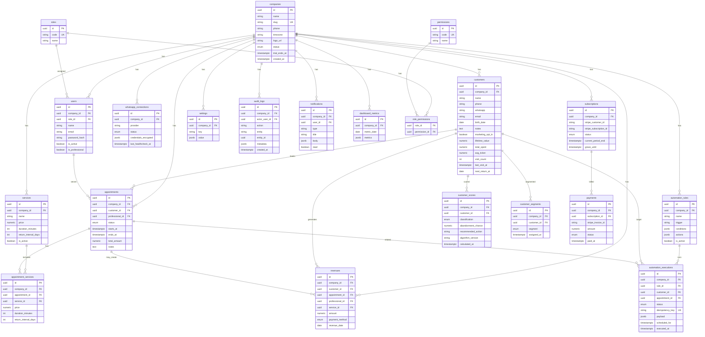

# 04 — Modelagem de Banco + ERD · VOLTTA™

**Versão:** 1.0  
**SGBD:** PostgreSQL  
**ORM:** Prisma  
**Regra:** toda tabela de negócio com `company_id` (exceto globais de catálogo de permissões).

---

## 1. Convenções

- PK: `uuid` (`gen_random_uuid()`)
- Timestamps: `created_at`, `updated_at` (timestamptz)
- Soft delete onde fizer sentido: `deleted_at`
- Money: `numeric(12,2)` + `currency` default `BRL`
- Enums Postgres tipados
- Índices compostos `(company_id, ...)` nas queries quentes

---

## 2. ERD (Mermaid)



---

## 3. Entidades e campos essenciais

### companies
`id`, `name`, `slug` (unique), `phone`, `timezone`, `logo_url`, `status` (`trialing|active|past_due|suspended|canceled`), `trial_ends_at`, `stripe_customer_id?`, timestamps

### users
`id`, `company_id`, `role_id`, `name`, `email` (unique por company), `password_hash`, `is_active`, `is_professional`, `refresh` via tabela auxiliar `refresh_tokens`

### refresh_tokens (adicional recomendada)
`id`, `user_id`, `company_id`, `token_hash`, `expires_at`, `revoked_at`, `user_agent`, `ip`

### customers
Campos PRD + `marketing_opt_in`, métricas desnormalizadas para performance de CRM/Score

### services
`return_interval_days` nullable

### appointments + appointment_services
Suporte a multi-serviço no mesmo horário; `ends_at` derivado da soma das durações

### customer_scores
Histórico ou upsert 1:1 atual — MVP: **1 score vigente por customer** (unique `company_id, customer_id`)

### customer_segments
Pode haver múltiplos segmentos; unique `(company_id, customer_id, segment)`

### automation_rules
Seed por company no onboarding (A1–A5). `conditions`/`actions` JSON schema versionado.

### automation_executions
`idempotency_key` unique global ou por company — ex.: `a2:{appointmentId}:{startsAt}`

### whatsapp_connections
Credenciais criptografadas (AES-GCM com key de env)

### subscriptions / payments
Espelho Stripe; fonte de verdade Stripe + projeção local

### revenues
Linha financeira; pode ser gerada no finalize

### dashboard_metrics
Snapshot diário JSON (CQRS read model)

### audit_logs / settings / notifications
Operação e compliance

---

## 4. Enums principais

```text
CompanyStatus: trialing | active | past_due | suspended | canceled
AppointmentStatus: pending | confirmed | canceled | completed
ScoreClass: loyal | attention | risk | lost
CustomerSegment: new | frequent | premium | risk | lost | recovered
AutomationExecutionStatus: scheduled | running | succeeded | failed | skipped
WhatsappConnectionStatus: disconnected | connecting | connected | error
SubscriptionStatus: trialing | active | past_due | canceled | unpaid
PaymentStatus: pending | paid | failed | refunded
PaymentMethod: pix | cash | card | other
RoleCode: ADMIN | BARBEIRO | RECEPCIONISTA
```

*UI pode mapear loyal→FIEL etc. em PT-BR.*

---

## 5. Índices críticos

```text
companies(slug) UNIQUE
users(company_id, email) UNIQUE
customers(company_id, whatsapp)
customers(company_id, last_visit_at)
appointments(company_id, starts_at)
appointments(company_id, professional_id, starts_at)
appointments(company_id, status, starts_at)
automation_executions(company_id, scheduled_for) WHERE status = 'scheduled'
automation_executions(idempotency_key) UNIQUE
revenues(company_id, revenue_date)
customer_scores(company_id, classification, abandonment_chance DESC)
subscriptions(stripe_subscription_id) UNIQUE
```

---

## 6. Isolamento multi-tenant

Checklist de schema:

- [x] FK `company_id` em todas tabelas de negócio
- [x] Unique constraints escopadas por company quando necessário
- [x] Sem joins cross-tenant possíveis sem filtro
- [x] Roles/permissions podem ser globais (seed); vínculo user→role ainda sob company

---

## 7. Políticas de retenção de dados

| Dado | Política MVP |
|------|----------------|
| audit_logs | 12 meses |
| automation_executions | 6 meses |
| dashboard_metrics | 24 meses |
| customers | soft delete; hard delete sob request LGPD |

---

## 8. Próximo artefato

→ [05 — Casos de Uso](05-use-cases.md)
