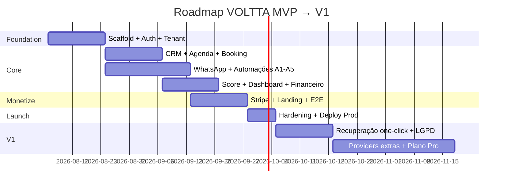

# 06 — Backlog + Roadmap · VOLTTA™

**Versão:** 1.0  
**Método:** MoSCoW + sprints de 2 semanas (referência)  
**Filtro de prioridade:** *Isso ajuda o cliente a voltar mais vezes?*

---

## 1. Épicos MVP

| Épico | Descrição | Prioridade |
|-------|-----------|------------|
| E01 Identity & Tenant | Auth JWT, RBAC, company, trial | Must |
| E02 Catalog & CRM | Serviços, clientes, indicadores | Must |
| E03 Scheduling | Agenda + link público | Must |
| E04 Messaging | WhatsApp Evolution + provider port | Must |
| E05 Automation Engine | Regras A1–A5 + filas | Must |
| E06 Score & Segments | Score VOLTTA + CRM segmentos | Must |
| E07 Finance & Dashboard | Receitas + dashboard | Must |
| E08 Billing Stripe | Checkout, portal, webhooks | Must |
| E09 Marketing Site | Landing + SEO básico | Must |
| E10 Platform | Docker, CI/CD, Swagger, testes | Must |
| E11 Hardening | LGPD, rate limit, audit | Should |
| E12 Polish UX | Onboarding delight, empty states | Should |

---

## 2. Backlog priorizado (P0 → P2)

### P0 — Foundation (Sprint 0–1)

| ID | Item | Épico | Story pts (est.) |
|----|------|-------|------------------|
| B-001 | Monorepo / apps api+web scaffold | E10 | 5 |
| B-002 | Prisma schema + migrations iniciais | E10 | 8 |
| B-003 | Auth signup/login/refresh/logout | E01 | 8 |
| B-004 | Forgot/reset password | E01 | 5 |
| B-005 | TenantGuard + RBAC guards | E01 | 5 |
| B-006 | Company settings + slug | E01 | 3 |
| B-007 | Seed roles/permissions + automation rules | E01 | 3 |

### P0 — Core retenção (Sprint 2–3)

| ID | Item | Épico | pts |
|----|------|-------|-----|
| B-010 | CRUD Customers + métricas | E02 | 8 |
| B-011 | CRUD Services | E02 | 5 |
| B-012 | Appointments CRUD + conflito horário | E03 | 13 |
| B-013 | Finalize → revenue + domain events | E03 | 8 |
| B-014 | Public booking page + API | E03 | 13 |
| B-015 | WhatsappProvider + EvolutionProvider | E04 | 13 |
| B-016 | Connection UI + healthcheck | E04 | 5 |
| B-017 | Automation orchestrator + A1 | E05 | 8 |
| B-018 | Delayed jobs A2/A3 | E05 | 8 |
| B-019 | A4 return campaign | E05 | 8 |
| B-020 | A5 birthday cron | E05 | 5 |
| B-021 | ScoreVolttaV1 + segments job | E06 | 13 |
| B-022 | Dashboard API + UI | E07 | 13 |
| B-023 | Finance list + indicators | E07 | 8 |

### P0 — Monetização & go-live (Sprint 4)

| ID | Item | Épico | pts |
|----|------|-------|-----|
| B-030 | StripeProvider checkout | E08 | 8 |
| B-031 | Webhooks + grace/suspend | E08 | 13 |
| B-032 | Customer portal link | E08 | 3 |
| B-033 | Landing page completa | E09 | 8 |
| B-034 | Onboarding checklist UI | E12 | 5 |
| B-035 | Docker Compose + GH Actions | E10 | 8 |
| B-036 | Swagger OpenAPI v1 | E10 | 5 |
| B-037 | Testes unit/integration core ≥80% | E10 | 13 |
| B-038 | Playwright E2E fluxos críticos | E10 | 8 |

### P1 — Should (pós-MVP imediato)

| ID | Item |
|----|------|
| B-040 | Campanha de recuperação manual one-click do Score |
| B-041 | Opt-out LGPD + export básico |
| B-042 | Relatórios CSV |
| B-043 | Multi-serviço UX refinada na agenda |
| B-044 | Notificações in-app de falha WhatsApp |
| B-045 | Disponibilidade / horários de funcionamento |

### P2 — Could (V1.x)

| ID | Item |
|----|------|
| B-050 | MetaProvider / ZApiProvider reais |
| B-051 | Plano Pro (>2 profissionais) |
| B-052 | Multi-unidade |
| B-053 | Fidelidade pontos |
| B-054 | App mobile |
| B-055 | A/B templates de mensagem |

---

## 3. Roadmap

### Marcos

| Marco | Definição de pronto |
|-------|---------------------|
| M1 Auth Tenant | Signup → JWT → isolamento testado |
| M2 Retention Loop | Appointment → WhatsApp → Return campaign |
| M3 Insight | Score + Dashboard usable |
| M4 Revenue | Stripe trial→paid E2E |
| M5 GA | Staging estável + CI + docs |

---

## 4. Ordem de implementação (alinha ao briefing)

1. Discovery ✅  
2. PRD ✅  
3. Arquitetura ✅  
4. Modelagem ✅  
5. ERD ✅  
6. Casos de uso ✅  
7. Backlog ✅  
8. APIs → [07-api-contract.md](07-api-contract.md)  
9. Backend  
10. Frontend  
11. WhatsApp  
12. Stripe  
13. Motor automações  
14. Dashboard  
15. Testes  
16. Docker  
17. CI/CD  
18. Deploy  

**Código de produto só após fechar o contrato de API (doc 07) e aceite explícito para iniciar implementação.**

---

## Próximo artefato

→ [07 — Contrato de API](07-api-contract.md)
